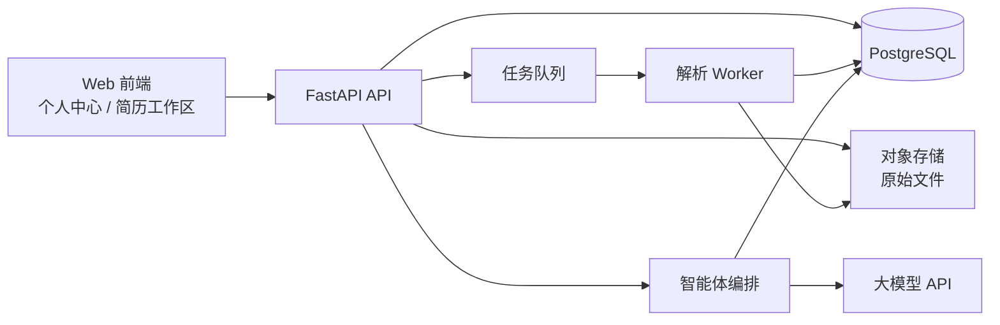
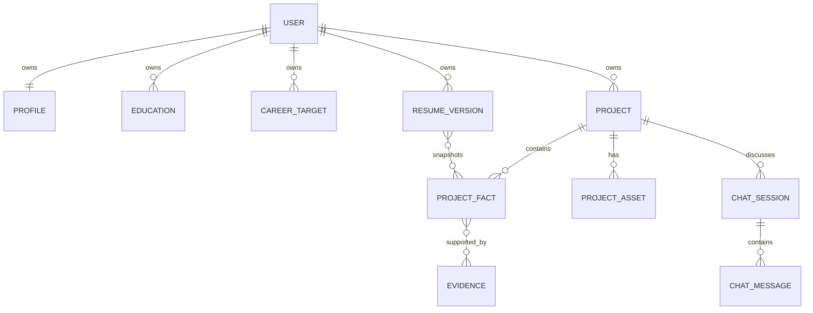

# 个人中心信息库实施方案

> 版本：V1.0  
> 日期：2026-08-08  
> 范围：个人中心（固定信息 + 项目经历）及其与简历、材料解析、智能体的第一条可交付链路

## 1. 结论与设计原则

个人中心不应是“另一份简历编辑器”，而应是用户的**可信求职信息库**：存放可复用、可追溯、可确认的个人事实。简历工作区、JD 匹配、项目面试题和模拟面试均从该信息库读取事实；它们各自生成的内容不能反向静默覆盖信息库。

本期将个人中心拆为两个一级域：

1. **固定信息**：用户主动维护的个人基础资料、教育状态、求职目标和技能标签。
2. **项目经历**：每个项目的事实卡、来源材料、个人职责、技术要点、难点和成果。项目经历可由用户手工创建，也可由简历、仓库、项目文件和对话收集后生成候选内容；候选内容必须确认后才成为可信事实。

### 1.1 必须遵守的规则

- 用户手工填写的值标记为 `user_entered`，可直接作为可信事实。
- 文件、仓库和对话解析出的值标记为 `extracted`，默认仅为“待确认”，不能直接进入简历或用于生成带事实断言的内容。
- 每一个提取或改写字段必须能定位到来源（文件页码/文本片段、仓库文件与行号、或会话消息）。
- 大模型只能整理、归纳、提出追问和生成候选描述；不能补充用户未提供的公司、职责、数据、成果或技术栈。
- 一份简历是信息库在某个时间点的“版本化快照”，而不是固定信息或项目经历的唯一来源。
- 允许字段为空。缺信息时以“待补充问题”提示，不能用模型猜测补齐。

这套边界直接满足需求文档中“所有生成内容尽可能基于用户确认过的事实”和“AI 建议不可静默覆盖正文”的要求。

## 2. 现有代码基线与接入点

当前仓库是 Magic Resume 前端，采用 TanStack Start、TypeScript、Zustand 和本地持久化；没有用户体系、后端 API、数据库或对象存储。

| 现有能力 | 现状 | 个人中心的处理方式 |
| --- | --- | --- |
| 基础信息 | `BasicInfo` 已有姓名、邮箱、电话、求职状态等字段 | 保留为简历展示字段；新增服务端 `Profile` 作为个人资料事实源，通过适配器同步 |
| 教育、工作、项目 | `Education`、`Experience`、`Project` 已由编辑器支持 | 保留编辑器模型；服务端用更完整的 `ProjectExperience` 存储，导出时转换为当前模型 |
| 简历本地保存 | `useResumeStore` 使用 `localStorage` | 过渡期继续保留本地草稿；新增云端版本及保存状态，不直接替换现有 Zustand 状态 |
| 控制台导航 | 位于 `apps/web/src/app/app/dashboard/client.tsx` | 增加“个人中心”入口 `/app/dashboard/profile` |
| 路由镜像 | `apps/web/src/app/**` 页面配合 `apps/web/src/routes/**` TanStack 路由文件 | 新页面必须同时补齐页面与路由镜像，避免开发环境和生产路由行为不一致 |

**不建议**把个人中心字段继续塞进 `BasicInfo.customFields`：它只适合简历排版中的可见字段，缺少来源、确认状态、访问控制、材料关联和历史记录，无法支撑智能体。

## 3. 用户体验与页面边界

### 3.1 导航与信息架构

在左侧导航中新增“个人中心”，进入 `/app/dashboard/profile`。页面使用两个主标签：

```text
个人中心
├── 固定信息
│   ├── 基本资料
│   ├── 教育背景与在读/求职状态
│   ├── 求职目标
│   └── 技能标签
└── 项目经历
    ├── 项目列表与完成度
    ├── 项目详情 / 事实卡
    ├── 导入材料
    └── 与智能体补充信息
```

“导入材料”是项目经历页中的操作入口，不单独做第三个信息域：它产生的是项目经历的候选事实和证据，而不是新的用户资料类型。

### 3.2 固定信息表单

固定信息按块保存，支持独立编辑和显示保存状态，避免长表单一次提交失败。首期字段如下。

| 分组 | 字段 | 必填 | 说明 |
| --- | --- | --- | --- |
| 基本资料 | 姓名、手机号、邮箱、所在城市 | 姓名 | 手机和邮箱需加密存储；城市可选 |
| 教育背景 | 学校、学历、专业、开始/毕业时间、在读状态 | 学校、学历、专业 | 可维护多段教育经历；在读状态为枚举 |
| 求职状态 | 工作年限、当前状态、目标岗位、目标城市、期望薪资、待解决问题 | 目标岗位可选 | 期望薪资仅本人可见，不进入默认简历 |
| 技能 | 语言、框架、数据库、工程工具及熟悉度 | 否 | 使用可增删标签；熟悉度用于自我整理，不将其自动写成能力结论 |

保存后显示“已保存于 xx:xx”；网络错误显示“保存失败，可重试”。对于简历已存在同名但不同值的字段，首次接入展示一次差异确认，不自动覆盖任何一侧。

### 3.3 项目经历工作流

用户可通过四条入口创建或完善项目：

```text
手工创建项目 ──────────────────────────────┐
上传简历 / PDF / DOCX ──> 文本提取 ─> 候选项目 ─┤
GitHub/Gitee 仓库地址 ─> 只读抓取 ─> 项目分析 ──┤─> 确认事实卡 ─> 项目经历
项目文件 / README ────> 解析与索引 ──────────┤
和智能体对话 ────────> 提取候选事实与追问 ────┘
```

每个项目详情固定包含以下内容：

- 基本信息：名称、时间、项目类型、仓库地址、项目摘要。
- 项目事实：业务背景、目标、架构/关键模块、技术栈。
- 个人贡献：本人角色、负责链路、具体行动、技术决策。
- 难点与结果：问题、方案、结果、量化指标及其证据。
- 证据与待确认项：每条事实的来源、置信度、确认状态和最后修改时间。

项目卡片只显示摘要、技术栈、确认度和待办数；进入详情后才显示材料和事实，避免把高度敏感的代码、链接和个人描述暴露在列表页。

### 3.4 对话补全体验

在项目详情页提供“补充项目经历”操作。智能体先读取**已确认事实**和相关候选事实，再按缺口提问，例如“你负责的是接口层、任务调度还是前端交互？请说明你实际修改过的模块”。

每轮对话后，服务端仅生成候选事实卡，例如“候选职责：负责 xx 链路”；用户可以逐条接受、编辑或拒绝。不能把聊天总结直接保存为项目描述，也不能将“可能”“参与”等模糊回答改写为确定的主导成果。

## 4. 服务端总体架构

建议新建独立 Python 服务，采用 FastAPI。前端保持在本仓库，后端建议放在 `services/api`；开发时通过 Vite/应用反向代理访问 `/api`，生产环境通过网关统一域名。



### 4.1 技术选型

| 层 | 选型 | 理由 |
| --- | --- | --- |
| API | FastAPI + Pydantic v2 + SQLAlchemy 2 | Python 生态适合异步任务、文档解析和智能体编排；自动生成 OpenAPI |
| 数据库 | PostgreSQL | 支持事务、JSONB、全文索引和严谨的用户数据隔离 |
| 迁移 | Alembic | 可审计的 schema 变更 |
| 异步任务 | Celery + Redis（或 MVP 用 RQ） | 文档解析、仓库抓取与 LLM 任务不能占用 HTTP 请求 |
| 文件存储 | S3 兼容对象存储（本地开发 MinIO） | 原始文件与数据库解耦，便于权限控制和删除 |
| 文档提取 | `pypdf`、`python-docx`、`unstructured` 按需使用 | PDF/DOCX 仅提取文本，不承诺版式还原 |
| 仓库抓取 | GitHub/Gitee API 优先，受限浅克隆作为兜底 | 可限制访问范围，避免执行不可信代码 |
| 观测 | 结构化日志 + Sentry/OTel | 日志脱敏，错误可追踪 |

### 4.2 推荐目录

```text
services/api/
  app/
    api/v1/            # profile、projects、assets、imports、chat
    models/            # SQLAlchemy 模型
    schemas/           # Pydantic 请求/响应 DTO
    services/          # 业务编排：确认、导出、冲突处理
    extractors/        # pdf、docx、resume、repository
    agents/            # 项目梳理、追问、结构化输出
    workers/           # 异步任务定义
    repositories/      # 数据访问和 user_id 隔离
    core/              # 配置、鉴权、日志、对象存储
  alembic/
  tests/
```

## 5. 数据模型

### 5.1 实体关系



### 5.2 核心表

| 表 | 关键字段 | 说明 |
| --- | --- | --- |
| `users` | `id`、`auth_subject`、`created_at` | 账号主体；匿名模式可用临时主体，转正时迁移 |
| `profiles` | `user_id`、`name`、`phone_ciphertext`、`email_ciphertext`、`city`、`job_status`、`version` | 一对一固定资料；`version` 用于乐观锁 |
| `educations` | `id`、`user_id`、`school`、`degree`、`major`、`start_date`、`end_date`、`study_status` | 允许多段教育经历 |
| `career_targets` | `id`、`user_id`、`roles`、`cities`、`salary_expectation_ciphertext`、`stage` | 求职偏好，不等同简历内容 |
| `skill_tags` | `id`、`user_id`、`name`、`category`、`proficiency` | 先做用户自填标签，不由 AI 自动提升熟练度 |
| `projects` | `id`、`user_id`、`name`、`date_range`、`role`、`summary`、`status`、`version` | 项目事实卡的聚合根；`status` 为 draft/active/archived |
| `project_facts` | `id`、`project_id`、`field`、`value_json`、`state`、`source_type`、`confidence`、`confirmed_at` | 可追溯字段。`field` 例如 `responsibility`、`challenge`、`metric` |
| `evidence` | `id`、`user_id`、`asset_id`、`message_id`、`locator`、`excerpt_hash` | 证据位置，如页码、文本区间或仓库文件与行号；原始片段从受控来源读取 |
| `project_fact_evidence` | `fact_id`、`evidence_id` | 一个事实可关联多条证据 |
| `project_assets` | `id`、`project_id`、`kind`、`storage_key`、`source_url`、`sha256`、`scan_status`、`expires_at` | 文件、仓库快照或链接元数据；禁止将源码正文直接塞进数据库 |
| `import_jobs` | `id`、`user_id`、`kind`、`status`、`progress`、`error_code`、`result_id` | 异步解析进度和失败原因 |
| `chat_sessions` / `chat_messages` | `project_id`、`role`、`content`、`fact_ids` | 项目补全对话，消息与候选事实关联 |
| `resume_versions` | `id`、`user_id`、`profile_snapshot`、`content_snapshot`、`template_id`、`source_resume_id` | 简历内容与个人中心在某时点的快照，保证可复现 |

### 5.3 事实状态机

`project_facts.state` 统一使用以下枚举，任何用于简历或题目事实断言的查询均默认只取 `confirmed`：

```text
extracted ──用户接受──> confirmed ──用户修改──> confirmed
    │                       │
    ├──用户编辑──> confirmed  └──新证据冲突──> needs_review
    └──用户拒绝──> rejected
```

`source_type` 取值为 `user_entered`、`resume_upload`、`project_file`、`repository`、`chat`。`confidence` 仅表示提取器对“文字归属/结构”的信心，不能替代用户确认。

### 5.4 事实字段的推荐结构

`value_json` 不使用无法约束的大段自由 JSON；按字段类型定义 schema。例如一个量化成果：

```json
{
  "metric_name": "接口 P95 延迟",
  "before": "待补充",
  "after": "120ms",
  "unit": "ms",
  "measurement_method": "压测报告",
  "claim_scope": "本人负责的缓存优化链路"
}
```

若 `before`、`measurement_method` 或证据缺失，UI 显示“待确认”，简历适配器不得把它渲染为“性能提升 xx%”。

## 6. API 契约

所有接口以 `/api/v1` 为前缀，从认证上下文获取 `user_id`，不接受客户端传来的 `user_id`。分页响应统一包含 `items`、`next_cursor`。

### 6.1 固定信息

| 方法 | 路径 | 用途 |
| --- | --- | --- |
| `GET` | `/profile` | 返回固定信息、教育、技能和版本号 |
| `PATCH` | `/profile` | 局部更新基础资料；请求携带 `version` 防止覆盖他人修改 |
| `PUT` | `/profile/educations` | 整体保存教育经历排序 |
| `PUT` | `/profile/skills` | 整体保存技能标签 |
| `GET` / `PATCH` | `/career-target` | 读取/更新求职目标 |

`PATCH /profile` 的响应必须返回服务器时间、最新 `version` 和字段级错误，前端据此更新“云端已保存”状态。

### 6.2 项目与事实确认

| 方法 | 路径 | 用途 |
| --- | --- | --- |
| `GET` / `POST` | `/projects` | 项目列表、手工创建项目 |
| `GET` / `PATCH` / `DELETE` | `/projects/{project_id}` | 项目详情、编辑、删除 |
| `GET` | `/projects/{project_id}/facts` | 按状态返回事实及证据摘要 |
| `POST` | `/projects/{project_id}/facts` | 手工录入事实，默认 `confirmed` |
| `PATCH` | `/projects/{project_id}/facts/{fact_id}` | 编辑候选或已确认事实 |
| `POST` | `/projects/{project_id}/facts/{fact_id}/confirm` | 确认候选事实 |
| `POST` | `/projects/{project_id}/facts/{fact_id}/reject` | 拒绝候选事实并保留审计记录 |
| `POST` | `/projects/{project_id}/export/resume` | 生成当前确认事实对应的 Magic Resume `Project` DTO 预览 |

### 6.3 导入与异步任务

| 方法 | 路径 | 用途 |
| --- | --- | --- |
| `POST` | `/uploads/presign` | 获取短期有效的受限上传地址 |
| `POST` | `/imports/resume` | 对已上传文件或纯文本创建简历解析任务 |
| `POST` | `/projects/{project_id}/assets` | 绑定项目文件并创建解析任务 |
| `POST` | `/projects/{project_id}/repository-imports` | 提交 GitHub/Gitee URL，启动只读分析 |
| `GET` | `/import-jobs/{job_id}` | 查询 `queued/running/succeeded/failed`、进度和结果摘要 |
| `POST` | `/import-jobs/{job_id}/retry` | 对可重试错误重新提交 |

`POST /repository-imports` 首期仅接受公开 HTTPS GitHub/Gitee 仓库 URL。拒绝本机地址、私有网段、重定向到非白名单域名的地址，防止 SSRF。

### 6.4 智能体对话

| 方法 | 路径 | 用途 |
| --- | --- | --- |
| `POST` | `/projects/{project_id}/chat-sessions` | 创建项目补全会话 |
| `POST` | `/chat-sessions/{session_id}/messages` | 提交回答，返回下一问和候选事实 |
| `POST` | `/chat-sessions/{session_id}/finish` | 结束会话，输出待确认清单 |

模型结构化输出必须经 Pydantic 校验，例如：

```json
{
  "next_question": "你在缓存改造中实际修改了哪些服务或接口？",
  "candidate_facts": [
    {
      "field": "responsibility",
      "value": {"text": "负责订单查询链路的缓存改造"},
      "evidence_message_ids": ["msg_123"],
      "requires_confirmation": true
    }
  ],
  "unknowns": ["缓存命中率和延迟改善数据尚未提供"]
}
```

未通过 schema 校验、无对应证据消息或 `requires_confirmation=false` 的模型事实一律丢弃并记录可观测错误。

## 7. 导入与智能体编排

### 7.1 简历导入

1. 前端直接上传至对象存储，随后创建 `resume` 类型 `import_job`。
2. Worker 校验 MIME、文件签名、大小和病毒扫描状态；PDF/DOCX 提取文本，图片型 PDF 返回“无法可靠提取文本”。
3. 提取器按 schema 输出个人资料、教育、工作和项目的**候选字段**，每项携带原文定位和置信度。
4. 前端展示确认页。用户选择“写入固定信息”“创建候选项目”或“忽略”。
5. 用户确认后才创建/更新 `profiles`、`educations`、`projects` 和 `project_facts`。

首期限制：单文件 20 MB；支持 PDF、DOCX、TXT、MD；不解析图片 OCR、不恢复文档排版、不自动合并语义相似项目。

### 7.2 仓库分析

1. 先做 URL 规范化和白名单校验，读取仓库基本元数据、默认分支和根目录文件列表。
2. 优先读取 `README`、依赖清单、部署/配置样例、架构文档和用户指定目录；设置最大文件数、单文件大小、总文本量与超时。
3. 禁止执行仓库中的脚本、构建命令、测试命令、容器配置或二进制文件。
4. 将仓库的技术栈、模块关系和可见功能作为“仓库证据”；将“用户本人负责什么”明确标记为未知，交给问答补全。
5. 智能体根据仓库证据发出最少必要追问，生成待确认职责、难点和结果候选。

仓库分析只能回答“代码中能看到什么”，不能证明“用户做了什么”。这是避免简历经历失真的关键边界。

### 7.3 项目文件与对话

- 项目文档：抽取章节、技术关键词、数字和问题解决描述；数字必须保留来源定位。
- 代码压缩包：首期建议只支持 ZIP，解压到临时隔离目录，限制展开后大小、层级和文件数，拒绝软链接、可执行文件和路径穿越；全程只读解析。
- 对话：原始消息是用户可确认的证据，但模型摘要仍是候选事实；不要把 AI 自己的回答作为证据。

### 7.4 智能体提示词策略

将编排拆为“提取”和“追问”两个角色，均使用严格 JSON 输出。

| 角色 | 输入 | 允许输出 | 禁止输出 |
| --- | --- | --- | --- |
| 事实提取器 | 用户材料片段及 locator | 原文支持的候选字段、置信度、未知项 | 推断贡献、补齐数据、评价能力 |
| 项目访谈官 | 已确认事实、未知项、用户消息 | 一次一个可回答的问题、候选事实 | 复述或扩写未被回答的成果 |
| 简历表达助手 | 已确认事实快照、目标 JD | 可编辑建议、使用的事实 ID、待确认提示 | 新增事实、静默写回简历 |

## 8. 前端实施方案

### 8.1 新增文件与职责

```text
apps/web/src/app/dashboard/profile/page.tsx        # 页面入口
apps/web/src/routes/app/dashboard/profile.tsx      # TanStack 路由镜像
apps/web/src/features/profile/api.ts                # API client 与 DTO 映射
apps/web/src/features/profile/types.ts              # 前端领域类型
apps/web/src/features/profile/ProfilePage.tsx       # 页面编排
apps/web/src/features/profile/FixedInfoForm.tsx     # 固定信息分块表单
apps/web/src/features/profile/ProjectList.tsx       # 项目列表
apps/web/src/features/profile/ProjectDetail.tsx     # 详情与事实卡
apps/web/src/features/profile/FactReviewPanel.tsx   # 接受/编辑/拒绝候选事实
apps/web/src/features/profile/ImportDialog.tsx      # 上传、仓库 URL、任务进度
apps/web/src/features/profile/ProjectInterviewPanel.tsx # 项目补全对话
apps/web/src/lib/resumeProfileAdapter.ts            # Profile/Project -> ResumeData 的纯函数
```

将服务端数据请求、缓存和重试放在 `apps/web/src/features/profile/api.ts`，不要扩展 `useResumeStore` 以管理个人中心。`useResumeStore` 继续服务于当前简历编辑交互；个人中心使用 TanStack Query 或同类服务端状态管理，避免本地草稿和云端事实混在一个 Store 中。

### 8.2 与 Magic Resume 的适配

新增纯函数适配层，而不是在组件内逐字段赋值：

```ts
toResumeBasic(profile, educations): Partial<ResumeData["basic"]>
toResumeEducation(educations): ResumeData["education"]
toResumeProjects(confirmedFacts): ResumeData["projects"]
```

调用流程：在简历工作区选择“从个人中心更新” -> 显示字段级 diff -> 用户勾选需要应用的字段 -> 适配器只更新所选字段 -> 调用现有 `updateBasicInfo`、`updateEducationBatch`、`updateProjectsBatch`。反向同步同样以 diff 确认方式进行，不让简历编辑器覆盖个人中心。

项目描述目前是字符串，首期从确认事实按稳定顺序生成：背景/职责/行动/结果；若缺少结果则不生成结果句。该输出只用于“写入简历前的预览”，用户仍可编辑。

### 8.3 UI 状态要求

- 页面初次加载、保存中、保存成功、保存失败、任务进行中、任务失败、无项目、无待确认项均需有明确状态。
- 文件解析使用轮询 `GET /import-jobs/{id}`，前端轮询间隔从 1 秒退避到 5 秒；任务完成、失败或页面卸载时停止。
- 每个候选事实显示来源标签和“查看证据”操作。无证据时只允许编辑为用户手工事实，不允许直接确认自动提取结果。
- 删除项目或材料使用二次确认；项目删除后可在 30 天内软删除恢复，文件从对象存储延迟清理。

## 9. 鉴权、隐私与安全

1. 上线前必须接入身份认证；开发期可由 FastAPI 依赖注入固定测试用户，不能把 `user_id` 放在请求体中作为权限依据。
2. 每个数据库查询都在 repository 层以认证用户 `user_id` 过滤；对象存储使用一次性、短有效期的上传/下载签名 URL。
3. 手机、邮箱、期望薪资加密存储；日志仅记录哈希、ID、文件大小、状态和错误码，禁止记录原文、Token、手机号或邮箱。
4. 上传前展示用途、保存期限和删除路径；支持删除单文件、单项目和全部个人数据。删除全部数据需异步清除数据库记录、对象及向量索引（若后续加入）。
5. 限制类型、大小、并发、总配额和解压后大小；上传文件进行恶意文件扫描；绝不执行用户代码。
6. 访问模型服务时只传完成任务所需的最小文本片段；模型供应商、数据保留策略和是否允许训练使用必须在隐私说明中明确。

## 10. 两人开发拆分与里程碑

建议先以四个短迭代实现可演示链路，而不是同时开发所有智能体能力。

| 迭代 | 前端负责人 | Python 后端负责人 | 联调产物 |
| --- | --- | --- | --- |
| 第 1 周：数据骨架 | 个人中心页面骨架、固定信息表单、Mock 数据、导航与路由 | FastAPI 工程、PostgreSQL/Alembic、认证桩、Profile/Project CRUD | 固定信息与手工项目可云端保存 |
| 第 2 周：事实确认 | 项目详情、事实卡、接受/编辑/拒绝、导入弹窗与任务状态 | 对象存储、上传签名、`import_jobs`、PDF/DOCX/TXT 纯文本提取 | 上传简历后能确认候选项目和字段 |
| 第 3 周：仓库与对话 | 仓库 URL 提交、项目补全聊天、证据查看 | URL 安全校验、只读仓库分析、结构化提取/追问 Agent | 仓库 + 对话产出可确认事实 |
| 第 4 周：简历接入 | Diff 确认、`resumeProfileAdapter`、云端状态展示、端到端测试 | Resume 快照、确认事实查询、观测与数据删除接口 | 个人中心事实可受控写入简历编辑器 |

两人共同维护一份 OpenAPI 定义和 JSON fixture。第 1 天先冻结 `Profile`、`Project`、`ProjectFact`、`ImportJob` 的 DTO；前端对照 fixture 开发，后端用契约测试保证返回结构不变。

## 11. MVP 验收场景

### 场景 A：手工资料

1. 用户填写姓名、学校、专业、在读状态和目标岗位，刷新后仍可见。
2. 网络保存失败时界面明确告知并可重试，不能伪装为已保存。
3. 用户可以新增一个项目，填写本人职责和技术栈；这些手工事实直接为已确认。

### 场景 B：简历导入

1. 用户上传 PDF/DOCX/TXT 后可查看解析进度和失败原因。
2. 解析结果将个人资料和项目经历列为候选，不自动写入固定信息、项目经历或简历。
3. 用户确认一个项目及其事实后，项目详情能看到原文证据定位。

### 场景 C：仓库 + 对话补全

1. 用户提交公开 GitHub/Gitee 地址，系统只读取允许的公开文件且不执行代码。
2. 系统能够提取技术栈、模块线索，但不会将其说成用户贡献。
3. 用户通过对话说明负责链路后，系统生成候选职责；用户确认后才可作为简历或面试题依据。

### 场景 D：简历回填

1. 用户在简历工作区发起“从个人中心更新”，能看到字段级差异。
2. 只更新用户勾选的字段，不覆盖未勾选内容。
3. 无确认成果或无证据的候选字段不生成夸大描述。

## 12. 风险与取舍

| 风险 | 处理决策 |
| --- | --- |
| 个人中心与当前简历模型不一致 | 使用独立领域模型和适配器；不直接修改现有 `ResumeData` 作为后端 schema |
| 文件/仓库解析误识别 | 结果一律候选化、显示证据和置信度、用户确认后生效 |
| 模型幻觉 | Agent 输出强制 JSON schema + 证据 ID 校验 + 不确定项列表；无依据不入库 |
| 代码和隐私材料泄露 | 私有隔离、最小传输、短期签名 URL、日志脱敏、可删除、禁止执行 |
| 两人并行等待接口 | 首先冻结 OpenAPI 与 fixtures；前端在 mock 之上实现，后端完成后切换 client |
| 范围膨胀 | 首期不做 OCR、私有仓库 OAuth、压缩包深度代码分析、自动合并项目、语音面试或整份简历一键重写 |

## 13. 开始实现前需要确认的产品决策

以下决策不阻塞第 1 周的 CRUD，但应在仓库/文件导入开始前确认：

1. 认证方案：课程原型使用匿名会话还是直接接入现成登录体系；这决定数据迁移与多端同步方案。
2. GitHub/Gitee 范围：MVP 是否只允许公开仓库。建议是，以避免 OAuth 授权、Token 存储和私有代码处理风险。
3. 文件保留期：建议原始上传文件默认保留 30 天，用户可提前删除；确认后的结构化事实可保留到用户删除。
4. 大模型供应商及数据政策：必须确认能否处理简历与代码片段、保留多久、是否用于训练。
5. 上线定位：若后续商业化，需要先处理 Magic Resume 仓库的商业授权限制，不能把课程原型直接作为 SaaS 对外运营。
